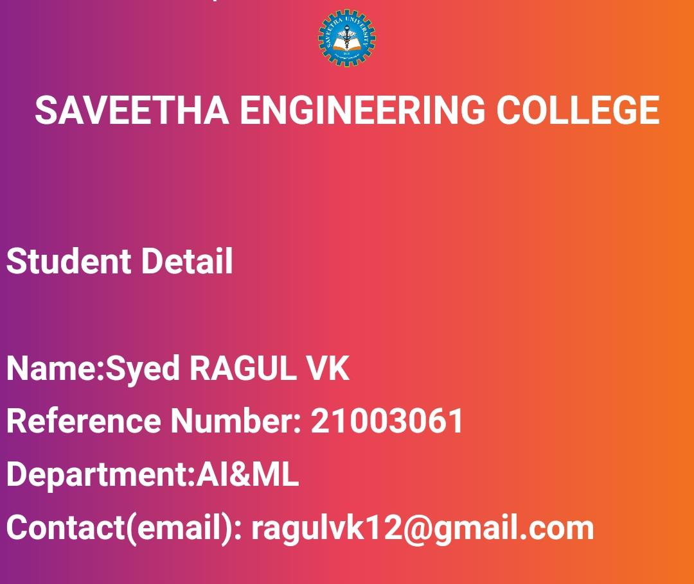

# Developing a Simple Webserver
## AIM:

To develop a simple webserver to serve html pages.
## DESIGN STEPS:
### Step 1:

HTML content creation
### Step 2:

Design of webserver workflow
### Step 3:

Implementation using Python code
### Step 4:

Serving the HTML pages.
### Step 5:

Testing the webserver
## PROGRAM:
~~~
<!DOCTYPE html>
<html>
<head>
<title>Saveetha Engineering College</title>
<link rel = "icon" href = 
"https://media.discordapp.net/attachments/533340656987275284/906080541344956436/kissclipart-saveetha-university-chennai-logo-clipart-saveetha-3a90c06681798db2.png" 
        type = "image/x-icon">
</head>
<body>

 
<h1>SAVEETHA ENGINEERING COLLEGE
</h1> 
 <h2>Student Detail</h2> 
<h3>Name:Syed RAGUL VK</h3>
<h3>Reference Number: 21003061</h3>
<h3>Department:AI&ML</h3>
<h3>Contact(email): ragulvk12@gmail.com</h3>

  

        

          

            

              

                
              

            

          

        

      
  

</body>
  
  <script>

</html>
"""
class myhandler(BaseHTTPRequestHandler):
    def do_GET(self):
        print("request received")
        self.send_response(200)
        self.send_header('content-type', 'text/html; charset=utf-8')
        self.end_headers()
        self.wfile.write(content.encode())
server_address = ('',2004)
httpd = HTTPServer(server_address,myhandler)
print("Website is running...")
httpd.serve_forever()

~~~
## OUTPUT:

## RESULT:
A WebServer Has Been Created Successfully!
